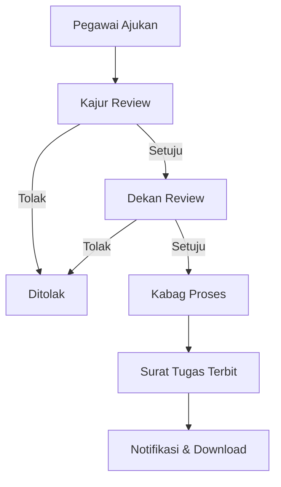

# 📝 Panduan Pengajuan Surat Tugas

## Apa itu Surat Tugas?

**Surat Tugas** adalah dokumen resmi dari fakultas yang memberikan izin atau perintah kepada pegawai untuk melaksanakan tugas di luar kampus atau di luar pekerjaan rutinnya.\
Contoh kegiatan yang membutuhkan Surat Tugas:

- Mengikuti seminar, konferensi, atau pelatihan.
- Perjalanan dinas resmi.
- Menghadiri rapat atau kegiatan kerja sama antar instansi.

Tanpa Surat Tugas, kegiatan tersebut tidak dianggap resmi dan bisa menyulitkan dalam laporan pertanggungjawaban.

---

## Siapa yang Bisa Mengajukan?

- 👩‍💼 **Pegawai** → mengajukan untuk dirinya sendiri.
- 👨‍🏫 **Atasan (Kajur/Kabag)** → bisa membantu mengajukan atas nama pegawai lain.

---

## Langkah-Langkah Mengajukan Surat Tugas

### 1. Akses Formulir

1. Login ke **PIAWAI FISIP**.
2. Pilih menu **Pengajuan → Surat Tugas**.

   
3. Akan muncul formulir pengajuan.

> 📸 _Screenshot 1: Tampilan halaman formulir Surat Tugas._
>
> 

4. Anda dapat mengisi daftar anggota untuk surat tugas. Ketik di Cari Pegawai.... Lalu pilih pegawai kemudian klik tambah.

   

---

### 2. Isi Data Dasar

Sebagian data sudah otomatis terisi (nama, NIP, jabatan, unit kerja).\
Anda hanya perlu melengkapi:

- **Tujuan Tugas** → contoh: "Mengikuti Pelatihan Digital Governance".
- **Lokasi** → contoh: "Pekanbaru, Hotel Pangeran".
- **Tanggal Mulai** → kapan kegiatan dimulai.
- **Tanggal Selesai** → kapan kegiatan berakhir.
- **Deskripsi Tugas** → jelaskan singkat kegiatan yang akan diikuti.

> 📸 _Screenshot 2: Formulir dengan kolom tujuan, lokasi, tanggal, dan deskripsi._
>
> 

---

### 3. Unggah Dokumen Pendukung

Tambahkan dokumen yang mendukung permohonan, misalnya:

- Surat undangan resmi.
- Dokumen pendukung lain (PDF, DOC, JPG).

Ukuran maksimal file: **10 MB**.

> 📸 _Screenshot 3: Bagian upload dokumen pada formulir._
>
> 

---

### 4. (Opsional) Ajukan untuk Orang Lain

Anda dapat mengajukan atas nama pegawai lain:

1. Centang opsi **“Ajukan untuk pegawai lain”**.
2. Cari nama pegawai dari daftar.
3. Lengkapi data dan dokumen seperti biasa.

> 📸 _Screenshot 4: Dropdown pilihan pegawai untuk diajukan Surat Tugas._

---

---

## Alur Persetujuan Surat Tugas

Proses pengajuan melalui beberapa tahap:

