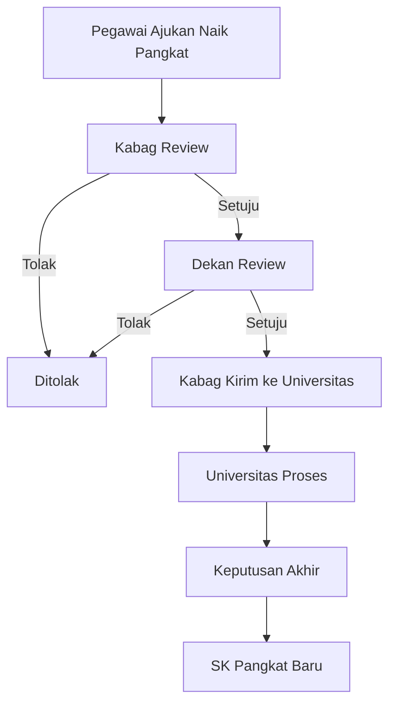

# 📈 Panduan Pengajuan Naik Pangkat

## Apa itu Naik Pangkat?

**Naik Pangkat** adalah kenaikan golongan pegawai berdasarkan masa kerja, prestasi, dan persyaratan tertentu.\
Contoh: dari III/a ke III/b, atau dari III/c ke III/d.

Dengan **PIAWAI FISIP**, pengajuan naik pangkat dilakukan secara online, sehingga lebih cepat dan transparan.

---

## Golongan Pegawai

- **Golongan I**: I/a, I/b, I/c, I/d
- **Golongan II**: II/a, II/b, II/c, II/d
- **Golongan III**: III/a, III/b, III/c, III/d
- **Golongan IV**: IV/a, IV/b, IV/c, IV/d

---

## Dokumen yang Wajib Disiapkan

1. 📑 **SK Pangkat Terakhir**
2. 📑 **SK Fungsional & PAK (Penilaian Angka Kredit)**
3. 📑 **SKP (Sasaran Kinerja Pegawai) 2 Tahun Terakhir**
4. 📑 **PAK Konversi** (jika ada)

Semua dokumen harus dalam format **PDF** dan ukuran maksimal **10 MB**.

---

## Langkah-Langkah Pengajuan Naik Pangkat

### 1. Akses Formulir

1. Login ke **PIAWAI FISIP**.
2. Pilih menu **Pengajuan → Naik Pangkat**.
3. Akan muncul formulir naik pangkat.

> 📸 _Screenshot 1: Halaman formulir naik pangkat._

---

### 2. Isi Data Pribadi

Isi data dasar kepegawaian Anda:

- Nama lengkap
- NIP (Nomor Induk Pegawai)
- Pangkat saat ini
- Golongan saat ini

> 📸 _Screenshot 2: Kolom data pribadi di formulir naik pangkat._

---

### 3. Unggah Dokumen

Unggah semua dokumen wajib:

- SK pangkat terakhir
- SK fungsional & PAK
- SKP 2 tahun terakhir
- PAK konversi (jika ada)

> 📸 _Screenshot 3: Bagian upload dokumen naik pangkat._

---

### 4. (Opsional) Ajukan untuk Orang Lain

Jika Anda Kabag/Kajur:

1. Centang opsi **“Ajukan untuk pegawai lain”**.
2. Pilih nama pegawai dari daftar.
3. Lengkapi data dan dokumen seperti biasa.

> 📸 _Screenshot 4: Dropdown pilihan pegawai untuk diajukan._

---

### 5. Kirim Pengajuan

1. Pastikan data dan dokumen benar.
2. Klik tombol **Submit Pengajuan**.
3. Tunggu notifikasi berhasil dikirim.

> 📸 _Screenshot 5: Halaman konfirmasi submit naik pangkat._

---

## Alur Persetujuan Naik Pangkat

Pengajuan melalui beberapa tahap:

